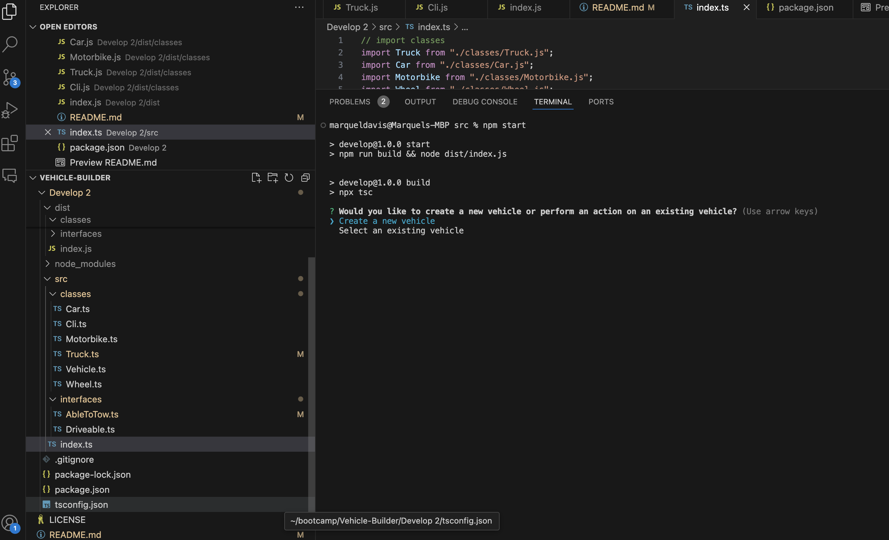

# Vehicle-Builder

## Description 
#### This application prompts the user to either create a new vehicle or select an existing vehicle. 
#### After going through the creation or selection process, the user is able to perform certain actions with the selected vehicle. 
#### The user is returned to the actions menu after each action until they decide to exit the application.

#### Challenges as a new learner in coding: For this project I created two additional classes, Truck and Motorbike. I added a unique function for both classes. For the truck class I added a function to allow certain trucks who weigh more than cars and motorbikes to be able to tow the vehicle. For motorbikes, I added a function to allow a user to perform an action which would allow the motorbike to wheelie. This was a fun project, I got a chance to learn more about classes and how to properly use another class properties and methods. I've also learned more about the importance of calling your base class before using "this." in constructor. 

  ## Table of Contents
  * [Installation](#installation)
  * [Usage](#usage)
  * [License](#license)
  * [Contributing](#contributing)
  * [Test](#test)
  * [Credits](#credits)
  * [Questions](#questions)
  

  ## Installation
  #### To install the necessary dependencies, run the following command:
  npm install
  #### It is important to install inquirer in your terminal to add to your package.json file if you don't have it already. This will allow you to prompt questions for users. You can install by using the following: 
  npm install inquirer.

  ## Usage
 
  #### In order to start the application you must write the following code in your terminal:
  npm start or npm run start. 

  

  

  ## Credits 
  Starter code credit to Rutgers boot camp 

   ## License
    This project is license under MIT. 
    
    
    
    
  
  
  ## Contributing
  According to github, on learning how to contribute to someones repo, you can use a fork and pull request1. Here is a link to the github documentation on how to fork and pull request: [Github Documentation](https://docs.github.com/en/get-started/exploring-projects-on-github/contributing-to-a-project)
  Since this is an open source project, check out the this link on contributor covenant: [Contributor Covenant](https://www.contributor-covenant.org/) This is a code of conduct for open source projects.
  
  ## Test
  To run tests, run the following command:
  npm test
  

  
  ## Questions
  If you have any questions about this repo, please contact me directly at marqueljamal12@gmail.com. You can find more of my work on github at [Marquel12](https://github.com/marquel12/Readme-Generator-) 
  